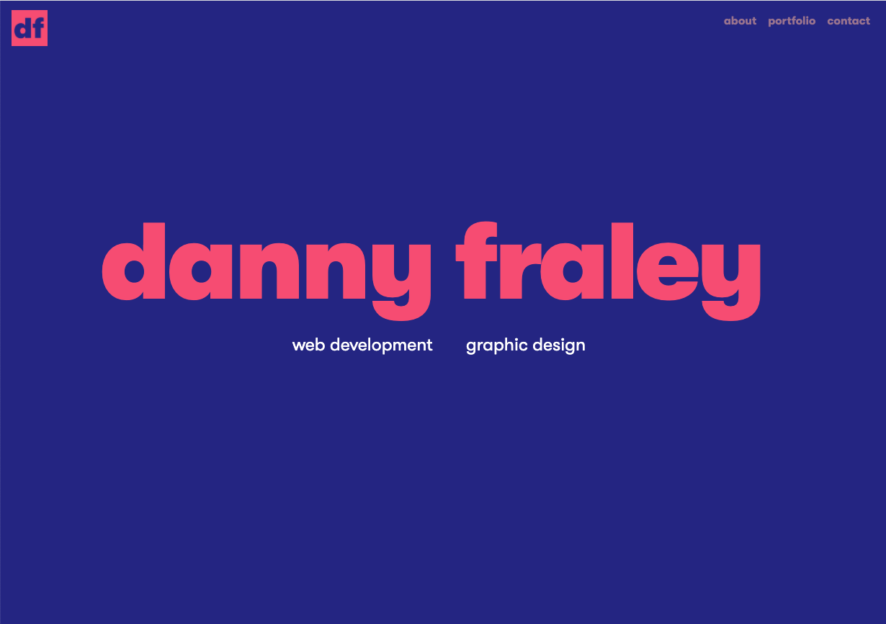
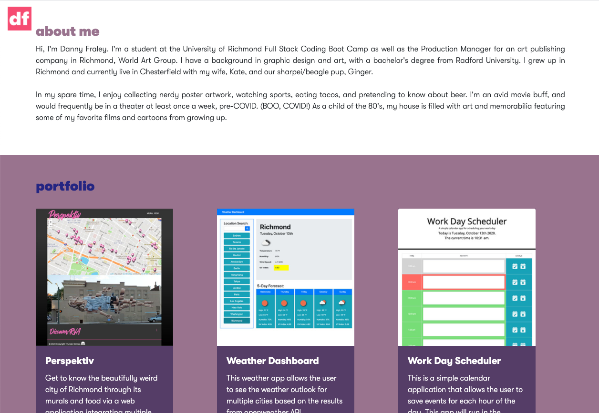
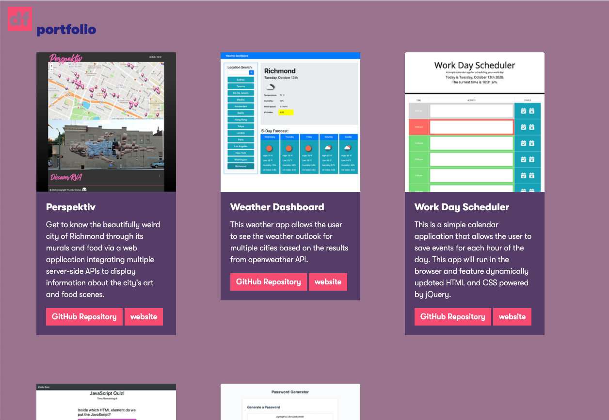

Updated Portfolio

A personal website featuring an animated welcome screen, an "About Me" section, and a portfolio featuring previews and links to some of the projects I have done so far in my career. Links provided will take the user to both a GitHub repository page, as well as the deployed website.

The page also features a link to my LinkedIn page, Instagram, Facebook, and a contact button to send an email.

Deployed site: https://dannyfraley.github.io/portfolio/
 
GitHub Repository: https://github.com/dannyfraley/portfolio
 
 
 

 
 
 

 
 
 

